# 📦 Estoque Min - Alerta de Estoque Baixo Ficha Técnica Uva

> Extensão Java para o ERP Sankhya — evento agendado que monitora o estoque dos insumos da ficha técnica dos cultivares de uva e dispara alertas via notificação no portal e e-mail quando o saldo atinge o limite cadastrado.

---

## 📋 Sobre o Projeto

Este projeto é uma customização Sankhya composta por:

- **Evento Agendado (ScheduledAction):** Executa periodicamente uma consulta que percorre os cultivares de uva ativos, suas fichas técnicas ativas e os insumos vinculados, verificando o estoque por controle/local na TGFEST. Quando o estoque atinge o limite cadastrado (`AD_EST_FICHA`), dispara alerta via notificação no portal e e-mail.
- **Controle de Duplicidade:** Utiliza o campo `AD_DTALERTA` na TGFEST para garantir que o alerta é enviado apenas **1x por dia**, independente da frequência do cron.
- **Notificação Multi-Usuário:** Envia notificação no portal Sankhya para múltiplos usuários configurados.
- **E-mail Automático:** Envia e-mail formatado no padrão visual da Argo Fruta via fila de mensagens do Sankhya.

---

## 🛠 Estrutura do Projeto

```
br.com.argo.estoquemin
├── controller/
│   └── EstoqueMinController.java    # Evento Agendado (ScheduledAction)
└── service/
    ├── NotificaUserService.java     # Notificação no portal (AvisoSistema)
    └── EnvioEmailService.java       # Envio de e-mail (Fila de Mensagens)
```

---

## 📖 Detalhes das Classes

### `EstoqueMinController.java`

Implementa `ScheduledAction` e executa via Agendador de Tarefas do Sankhya.

**Responsabilidades:**

- Executa a consulta SQL que percorre: `TGFPRO (Uva)` → `AD_FICHATECPROD (ativas)` → `AD_FICHATECITE (insumos + controle)` → `TGFEST (estoque por controle/local 3030000)`.
- Filtra apenas insumos onde `ESTOQUE <= AD_EST_FICHA AND ESTOQUE > 0`.
- Aplica controle de duplicidade: `AD_DTALERTA IS NULL OR TRUNC(AD_DTALERTA) < TRUNC(SYSDATE)`.
- Agrupa resultados por insumo/controle (1 linha por insumo, sem repetir por produto uva).
- Monta mensagem HTML com dados formatados em decimal brasileiro (`#,##0.00`).
- Delega notificação para `NotificaUserService` e e-mail para `EnvioEmailService`.
- Após envio, executa `UPDATE TGFEST SET AD_DTALERTA = SYSDATE` via `NativeSql` com named parameters para marcar como alertado.

### `NotificaUserService.java`

Envia notificações no portal Sankhya via `AvisoSistema` (TSIAVI).

**Responsabilidades:**

- Utiliza `JapeFactory.dao("AvisoSistema")` com `DynamicVO` para criar os avisos.
- Itera sobre um array de códigos de usuários (`USUARIOS_ALERTA`) para notificar múltiplos destinatários.
- Configura: `IDENTIFICADOR = "ESTOQUE_MIN_UVA"`, `IMPORTANCIA = 3`, `TIPO = "P"`.

### `EnvioEmailService.java`

Envia e-mails via fila de mensagens do Sankhya (TMDFMG).

**Responsabilidades:**

- Utiliza `JapeFactory.dao(DynamicEntityNames.FILA_MSG)` para inserir na fila.
- E-mail formatado em HTML no padrão visual Argo Fruta (logo, tipografia Poppins).
- Configurável: destinatário definido na constante `EMAIL_DESTINATARIO`.

---

## 🗄 Requisitos de Banco de Dados (Oracle)

### Tabelas e Instâncias Utilizadas

| Tabela Banco       | Instância Java        | Descrição                              |
|--------------------|-----------------------|----------------------------------------|
| `TGFPRO`           | `Produto`             | Cadastro de Produtos (filtro AD_CULTIVAR = 'Uva') |
| `AD_FICHATECPROD`  | `AD_FICHATECPROD`     | Ficha Técnica - Cabeçalho (filtro ATIVO = 'S') |
| `AD_FICHATECITE`   | `AD_FICHATECITE`      | Ficha Técnica - Itens/Insumos          |
| `TGFEST`           | `Estoque`             | Estoque por Controle/Local             |
| `AD_PRODCIP`       | `AD_PRODCIP`          | View Revenda e CIP (view da TGFPRO)   |
| `TSIAVI`           | `AvisoSistema`        | Notificações do Portal                 |
| `TMDFMG`           | `FilaMensagem`        | Fila de Mensagens (E-mail)             |

### Campos Customizados na TGFEST

| Campo           | Tipo            | Descrição                                      |
|-----------------|-----------------|-------------------------------------------------|
| `AD_EST_FICHA`  | Número Decimal  | Limite de estoque para alerta (cadastrado pela usuária) |
| `AD_DTALERTA`   | Data            | Data do último alerta enviado (controle duplicidade) |

### Relacionamento da Consulta

```
TGFPRO (AD_CULTIVAR = 'Uva', ATIVO = 'S')
  │
  └─► AD_FICHATECPROD (ATIVO = 'S')
       │   JOIN: CODPROD = CODPROD
       │
       └─► AD_FICHATECITE
            │   JOIN: CODPROD + CODPRODMP + CODPRODCX
            │
            └─► TGFEST
                    JOIN: CODPROD = CODPRODINS
                      AND CONTROLE = CONTROLE
                      AND CODLOCAL = 3030000
                    │
                    └─► ESTOQUE <= AD_EST_FICHA ?
                         ├── SIM + ESTOQUE > 0 → ALERTA
                         └── NÃO ou ZERADO → IGNORA
```

---

## 🔧 Consulta SQL Principal

```sql
SELECT
    EST.CODPROD                    AS COD_INSUMO,
    INS.DESCRPROD                  AS DESCR_INSUMO,
    EST.CONTROLE                   AS CONTROLE,
    EST.CODLOCAL                   AS CODLOCAL,
    EST.ESTOQUE                    AS ESTOQUE_ATUAL,
    EST.AD_EST_FICHA               AS LIMITE_ALERTA,
    COUNT(DISTINCT PROUVA.CODPROD) AS QTD_UVAS_AFETADAS
FROM TGFPRO PROUVA
INNER JOIN AD_FICHATECPROD FTP
    ON  FTP.CODPROD = PROUVA.CODPROD
    AND FTP.ATIVO   = 'S'
INNER JOIN AD_FICHATECITE FTI
    ON  FTI.CODPROD   = FTP.CODPROD
    AND FTI.CODPRODMP = FTP.CODPRODMP
    AND FTI.CODPRODCX = FTP.CODPRODCX
INNER JOIN TGFEST EST
    ON  EST.CODPROD  = FTI.CODPRODINS
    AND EST.CONTROLE = FTI.CONTROLE
    AND EST.CODLOCAL = 3030000
LEFT JOIN TGFPRO INS ON INS.CODPROD = FTI.CODPRODINS
WHERE PROUVA.ATIVO       = 'S'
  AND PROUVA.AD_CULTIVAR = 'Uva'
  AND EST.AD_EST_FICHA   IS NOT NULL
  AND EST.ESTOQUE        <= EST.AD_EST_FICHA
  AND EST.ESTOQUE        > 0
  AND (EST.AD_DTALERTA IS NULL OR TRUNC(EST.AD_DTALERTA) < TRUNC(SYSDATE))
GROUP BY
    EST.CODPROD, INS.DESCRPROD, EST.CONTROLE,
    EST.CODLOCAL, EST.ESTOQUE, EST.AD_EST_FICHA
ORDER BY EST.CODPROD
```

---

## 🚀 Guia de Implantação (Deploy)

### 1. Campos no Dicionário de Dados

| Passo | Ação |
|-------|------|
| 1     | Acesse a tela **Dicionário de Dados** no Sankhya |
| 2     | Busque a tabela **TGFEST** (Estoque) |
| 3     | Adicione o campo **AD_EST_FICHA** → Número Decimal, Descrição: "Estoque ficha" |
| 4     | Adicione o campo **AD_DTALERTA** → Data, Descrição: "Data último alerta" |

### 2. Compilação

Gere o arquivo `.jar` do projeto:

```
ESTOQUE-MIN-FICHA-UVA.jar
```

### 3. Cadastro do Módulo Java

| Passo | Ação |
|-------|------|
| 1     | Acesse a tela **Módulo Java** no Sankhya |
| 2     | Clique em **+** para adicionar novo registro |
| 3     | **Descrição:** `ESTOQUE-MIN-FICHA-UVA` |
| 4     | Na aba **Arquivo Módulo (Jar):** faça upload do `.jar` |
| 5     | Anote o **código do módulo** gerado |

### 4. Configuração da Ação Agendada

| Campo     | Valor |
|-----------|-------|
| **Tela**  | Ações Agendadas |
| **Tipo de gatilho** | Expressão CRON |
| **Expressão CRON** | `0 */5 * * * ?` (A cada 5 minutos) |
| **Módulo** | Selecione o módulo criado no passo 3 |
| **Classe** | `br.com.argo.estoquemin.controller.EstoqueMinController` |

> **Sugestões de CRON:**
> - `0 0 7 * * ?` → Todos os dias às 7h
> - `0 0 7,13 * * ?` → Duas vezes ao dia (7h e 13h)
> - `0 0 7 ? * MON-FRI` → Dias úteis às 7h

### 5. Configuração do E-mail

Na classe `EnvioEmailService.java`, altere a constante `EMAIL_DESTINATARIO` para o e-mail correto.

### 6. Configuração dos Usuários

Na classe `NotificaUserService.java`, altere o array `USUARIOS_ALERTA` com os códigos dos usuários que devem receber a notificação no portal.

### 7. Cadastro do AD_EST_FICHA nos Insumos

| Passo | Ação |
|-------|------|
| 1     | Acesse a tela **Produtos** no Sankhya |
| 2     | Busque o insumo desejado (ex: 2789 - CUMBUCA ARTICULADA) |
| 3     | Vá na aba **Estoque** |
| 4     | No registro do **Local 3030000** com o **Controle** correto |
| 5     | Preencha o campo **Estoque ficha** com o valor de alerta |

---

## 🔄 Fluxo de Funcionamento

```mermaid
sequenceDiagram
    participant Cron as Agendador Sankhya
    participant Controller as EstoqueMinController
    participant DB as Oracle DB
    participant Notif as NotificaUserService
    participant Email as EnvioEmailService

    Cron->>Controller: onTime() dispara
    Controller->>DB: SELECT insumos com estoque no limite
    DB-->>Controller: Resultados (ou vazio)

    alt Tem insumos em alerta
        Controller->>Controller: Monta HTML formatado
        Controller->>Notif: notifUsu() para cada usuário
        Notif->>DB: INSERT INTO TSIAVI (para cada CODUSU)
        Controller->>Email: enviarEmail()
        Email->>DB: INSERT INTO TMDFMG (fila de mensagens)
        Controller->>DB: UPDATE TGFEST SET AD_DTALERTA = SYSDATE
        Controller->>Cron: Log "X insumo(s) alertados"
    else Nenhum alerta
        Controller->>Cron: Log "Estoque OK"
    end
```



---

## ⚠️ Observações Importantes

- **Local Fixo:** A consulta filtra apenas o local `3030000` (PH UVA EMB). Para monitorar outros locais, altere a constante `COD_LOCAL_PRODUCAO` na classe `EstoqueMinController`.
- **Cultivar:** O filtro usa `AD_CULTIVAR = 'Uva'`. Se o valor no banco for diferente (ex: `'UVA'`, `'uva'`), ajuste na consulta SQL.
- **Controle Obrigatório:** Apenas insumos com controle/lote preenchido na ficha técnica (`AD_FICHATECITE.CONTROLE`) são monitorados. Insumos sem controle (ex: SACO, CAIXA sem lote) não entram na consulta.
- **Estoque Zerado:** Quando o estoque chega a 0, o insumo sai automaticamente da consulta (`ESTOQUE > 0`). O alerta serve para **antecipar**, não para reportar o que já zerou.
- **1x por Dia:** O controle via `AD_DTALERTA` garante que mesmo com cron frequente (ex: a cada minuto), o alerta é enviado apenas 1 vez por dia por insumo/controle.
- **Banco de Dados:** O projeto é otimizado para **Oracle** (usa `NVL`, `TRUNC`, `SYSDATE`).

---

## 📝 Changelog

| Versão | Data       | Tipo     | Descrição |
|--------|------------|----------|-----------|
| 1.0.0  | 2026-03-02 | feat     | Implementação inicial da consulta SQL de estoque baixo |
| 1.1.0  | 2026-03-02 | feat     | Evento agendado (ScheduledAction) com notificação e e-mail |
| 1.2.0  | 2026-03-02 | feat     | Controle de duplicidade com AD_DTALERTA (1x por dia) |
| 1.2.1  | 2026-03-02 | fix      | Formatação decimal brasileiro no e-mail (#,##0.00) |
| 1.2.2  | 2026-03-02 | fix      | Remoção do campo Margem do e-mail |
| 1.2.3  | 2026-03-02 | fix      | Correção vírgula extra no UPDATE marcarComoAlertado |
| 1.3.0  | 2026-03-07 | feat     | Notificação para múltiplos usuários via array |
| 1.3.1  | 2026-03-07 | fix      | UPDATE com named parameters padrão NativeSql Sankhya |

---

## 🧑‍💻 Autor

**Natan** — Backend Developer

---

## 📄 Licença

Projeto proprietário — uso interno Argo Fruta.
